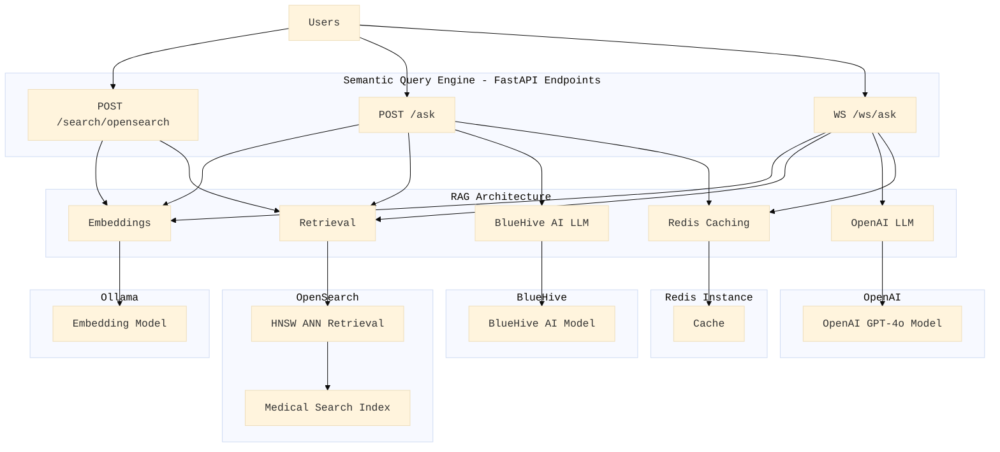

# **RAG-Based Medical Semantic Search & Query Answering System**

A Retrieval-Augmented Generation (RAG) application designed for **semantic search and intelligent query answering** on medical and EHR documents. This system seamlessly integrates **Ollama's jina/jina-embeddings-v2-base-de** for high-quality embeddings, **BlueHiveAI** and **OpenAI** LLMs for context-aware text generation. It leverages **OpenSearch** for efficient **Approximate Nearest Neighbor** (ANN) vector searches and utilizes **Redis** for intelligent query caching, ensuring accurate responses with consistent near real-time latencies (<3.5s).

---



---

## **Key Features**
- **Semantic Search**: Utilizes **jina/jina-embeddings-v2-base-de** (768-dimensional vectors) through Ollama to generate high-dimensional semantic representations of text.
- **Retrieval-Augmented Generation (RAG)**: Combines **OpenSearch** for vector-based ANN retrieval with **BlueHiveAI** for advanced query answering.
- **Efficient Caching**:
  - **Redis** stores query embeddings and responses to reduce latency and optimize performance.
  - Uses **cosine similarity** for cache lookups to avoid redundant computation.
- **Fast and Scalable Search**:
  - **OpenSearch HNSW ANN** enables efficient nearest-neighbor searches.
  - Capable of indexing and retrieving large-scale medical document datasets.
- **REST API Integration**: Exposes endpoints for semantic search and query answering over indexed medical texts using **FastAPI**.
- **Robust Text Processing**:
  - Cleans and chunks text before embedding.
  - Retrieves relevant document chunks for context-aware answers.
- **Error Handling & Resilience**:
  - Comprehensive exception handling for HTTP requests.
  - Graceful fallbacks and informative error messages for better user experience.

---

## **How It Works**
1. **Embedding Generation**:
   - Input text is converted into embeddings using **jina/jina-embeddings-v2-base-de** via Ollama.
2. **Query Caching**:
   - Query embeddings are compared with cached results in **Redis**.
   - If a similar query is found, the cached response is returned, reducing latency.
3. **ANN-Based Retrieval**:
   - If no cache hit, **OpenSearch** performs **HNSW ANN** retrieval to find the most relevant document chunks.
4. **Contextual Response Generation**:
   - Retrieved context is sent to **BlueHiveAI** or **OpenAI** for final answer generation.
   - The response is stored in Redis for future queries, optimizing performance.

---

## Retrieval-Augmented Query Answering**
- **Endpoint**: `/ask`
- **Method**: `POST`
- **Request**:
    ```json
    {
        "body": "What is Ghrelin?"
    }
    ```
- **Response**:
    ```json
    {
        "query": "What is Ghrelin?",
        "answer": "Ghrelin is a peptide hormone secreted by endocrine cells in the gastrointestinal tract, known for its role in stimulating food intake and regulating energy balance. It acts in the central nervous system to modulate gastrointestinal functions, such as gastric acid secretion and motility, and is involved in the autonomic regulation of these functions. Ghrelin's effects on food intake are mediated by neuropeptide Y pathways in the central nervous system (Document ABC, Document XYZ)."
    }
    ```
    
---

## **Architecture Overview**
The system is architected as a **microservices-based RAG pipeline** with the following components:
- **FastAPI**: Exposes RESTful endpoints for query input and response output.
- **Ollama Embedding Service**: Generates high-dimensional embeddings using **jina/jina-embeddings-v2-base-de**.
- **OpenSearch**: Stores indexed document embeddings and performs **HNSW ANN** retrieval.
- **Redis**: Caches query embeddings and responses for efficient lookups.
- **BlueHiveAI**: Handles text generation using retrieved context, ensuring intelligent and context-aware answers.
- **OpenAI**: Handles text generation with the retrieved context using the **'streaming'** mode, ensuring intelligent and context-aware answers with additional usability in WebSocket based APIs and not just HTTP.

---

## **Setup and Deployment**

### **Prerequisites**
1. **Python 3.8+**
2. **Environment Setup**:
   - **Ollama**: Running locally on `http://localhost:11434/api` or in a cloud environment
   - **OpenSearch**: Hosted locally or in a cloud environment
   - **Redis**: Running locally or in a cloud environment on port `6379`

### **Install Dependencies**
```bash
pip install -r requirements.txt
```

### **Run the Server**
```bash
uvicorn main:app --host 0.0.0.0 --port 8000 --reload
```

---

## **Code Highlights**

### **1. Redis-based Query Caching**
- Caches query embeddings and responses to optimize performance.
- Utilizes **cosine similarity** to identify previously asked queries and avoid redundant API calls.

### **2. OpenSearch ANN Indexing**
- Documents are indexed using **HNSW (Hierarchical Navigable Small World)** for fast vector retrieval.
- Search results are ranked based on similarity scores.

### **3. Dynamic Query Handling**
- Queries first check **Redis cache** for stored responses.
- If no cached response is found, **OpenSearch** retrieves relevant documents.
- **BlueHiveAI** or **OpenAI** generates final responses based on retrieved context.
- The new query-response pair is cached in Redis for future lookups.

---

## **Scalability & Performance**
- **OpenSearch** supports indexing **millions of documents** for scalable retrieval.
- **Redis caching** significantly reduces response latency.
- **Ollama's jina/jina-embeddings-v2-base-de** ensures accurate semantic understanding.
- **BlueHiveAI** or **OpenAI** provides context-aware text generation with consistent latencies <3.5s.

---

## **Future Improvements**
- Add **multi-hop document retrieval** for handling even more complex queries.
- Optimize **query expansion techniques** for better recall.
- Add support for **multi-modal retrieval** (text + images).
- Implement **continuous learning** to refine embeddings over time.
- Integrate **advanced ranking models** for improved search relevance.
- Add a Full-stack interface for the RAG-based medical chatbot application encompassing the semantic query engine.

---

Feel free to reach out for any improvements, suggestions, or discussions. Your contributions are always welcome! 🚀
